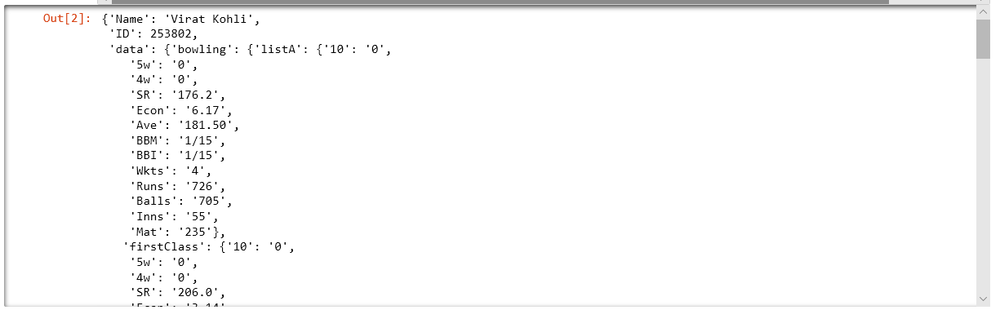

# Optimization of Indian Cricket Team Selection using MIP 

Authors:  **Sujay Anjarlekar**, **Gaurav Rajgure**

YouTube Video:  [Link](https://youtu.be/3CF9PqGYOsE)

---

## Introduction
Cricket was invented in the vast fields of England, supposedly by shepherds who herded their flock. Later on this game was shown benevolence by aristocrats, and now has the stature of being England's national game. After a century now, cricket stands in the international arena, with a place of its own. Cricket involves two teams with 11 players on each side. The captain who wins the toss decides whether his team bats or bowls first. If they bat first, their aim is to score a lot of runs and make sure the other team does not reach that score. Cricket is played in many formats, but the most popular are TEST CRICKET, ONE DAY INTERNATIONAL (ODI) & T20 International cricket. We are using the Cricapi to get the stats of the players. This api gives the whole statistics of the player he have till date. Also they update their data after every game. We are aiming to find best Cricket team for ODI, T20I and Test matches using current statistics of players of India which are in their best form since last 5 years. We are using Mixed integer programming model to find best teams of all formats using optimization function of puLP library.In this, we are maximizing weighted score of each team considering player's statistics.We are comparing our Model's output teams of all formats with the current teams of india. Calculated percentage errors of different weighted scores to evaluate our model.


---

## References

- The code retrieves data from [Cric API](https://www.cricapi.com/)
- Optimization Library:[PuLP 1.6.0 documentation](https://pythonhosted.org/PuLP/)
- Wikipedia link :[Wikipedia](https://en.wikipedia.org/wiki/Cricket/)
---

## Requirements

- Python Libraries : requests,numpy,pandas,pulp,matplotlib
- API Key link: https://www.cricapi.com/fan/signup.aspx?returnURL=https://www.cricapi.com (go to this link and sign up for free api)

---

## Explanation of the Code

Program File Name: `Optimization_of_Cricket_team_selection.ipynb`
#### Importing Required Libraries
```
import requests
import numpy as np
import pandas as pd
import pulp
import matplotlib.pyplot as plt
```
NOTE: You will need to install puLP package by using command `pip install pulp` using python iteractive shell.

#### Catching Data From puLP API
 Players who are in their good form in past 5 years 
 Below player list contains player ID's on the Cricapi.com
```
 player=[253802,28081,34102,625371,931581,422108,625383,28235,290716,234675,277916,30045,32540,236779,481896,326016,559235,430246,33141,376116]
y = {} # Creating empty dictionary y in which all players data will be stored
# Using for loop for getting data 
for i in range(len(player)):
    # Requesting the api for the player stats
    x=requests.get('http://cricapi.com/api/playerStats?apikey=#########################'+str(player[i])).json() # Add Apikey here
    z={} # Empty dictionary for data of player respectively
    # Adding the required data from the data given by api to the dictionary z
    z['Name']=x['fullName']
    z['ID'] = x['pid']
    z['data']=x['data']
    l=i+1
    # Adding z dictionaryof each player in main dictionary y with key of the index in which we are getting data
    y[l]=z     
#Checking data caught from api
y[1]
``` 
The output will be information about player which we have caught from API.



#### Data Cleaning
Doing the data Cleaning in following Steps
1) Deleting Unnecessary Data of players of formats in following order
    a) ODI Stat data
    b) T20Is Stat data
    C) Test Stat data 
2) Replacing '-' values by O for all data we required 
```
t=y.copy() # copying the y dictionary as another dictionary t which we will use in next steps
# Deleting unncessary data
for l in range(len(t)):
    i=l+1
    del t[i]['data']['bowling']['listA']
    del t[i]['data']['bowling']['firstClass']
    del t[i]['data']['batting']['listA']
    del t[i]['data']['batting']['firstClass']
t=y.copy() # copying the y dictionary as another dictionary t which we will use in next steps
ODIs=[1,2,3,4,6,7,8,9,10,11,12,13,14,15,16,17,18,19,20] # Players who plays in ODIs
tests=[1,3,4,6,8,10,11,12,13,14,15,16,17,20] # Players who plays in Tests 
T20Is=[1,2,3,4,6,7,8,9,10,11,12,14,15,16,17,18,19,20] # Players who play in T20Is
# In the next step we are replacing the values '-' by 0
# Firstly replacing '-' values of ODIs 
for i in ODIs:
        if t[i]['data']['batting']['ODIs']['SR']=='-':
            t[i]['data']['batting']['ODIs']['SR']=0
        if t[i]['data']['batting']['ODIs']['Ave']=='-':
            t[i]['data']['batting']['ODIs']['Ave']=0
        if t[i]['data']['bowling']['ODIs']['Ave']=='-':
            t[i]['data']['bowling']['ODIs']['Ave']=0
        if t[i]['data']['bowling']['ODIs']['SR']=='-':
            t[i]['data']['bowling']['ODIs']['SR']=0
              
# Similaraly for the tests data       
for i in tests:
        if t[i]['data']['batting']['tests']['SR']=='-':
            t[i]['data']['batting']['tests']['SR']=0
        if t[i]['data']['batting']['tests']['Ave']=='-':
            t[i]['data']['batting']['tests']['Ave']=0
        if t[i]['data']['bowling']['tests']['Ave']=='-':
           t[i]['data']['bowling']['tests']['Ave']=0
        if t[i]['data']['bowling']['tests']['SR']=='-':
           t[i]['data']['bowling']['tests']['SR']=0
# Similarly for the T20Is
for i in T20Is:
        #print(i)
        if t[i]['data']['batting']['T20Is']['SR']=='-':
            t[i]['data']['batting']['T20Is']['SR']=0
        if t[i]['data']['batting']['T20Is']['Ave']=='-':
            t[i]['data']['batting']['T20Is']['Ave']=0
        if t[i]['data']['bowling']['T20Is']['Ave']=='-':
            t[i]['data']['bowling']['T20Is']['Ave']=0
        if t[i]['data']['bowling']['T20Is']['SR']=='-':
            t[i]['data']['bowling']['T20Is']['SR']=0

```
If this cell doesnt work properly, it will give error. Else you are fine to go ahead!
#### Optimization Model for selecting ODI Team
Nowing creating the optimization model using the puLP function of optimization.
The detail of each step is given in following codes
In this code you will find the weighted scores for batter, bowler & allrounder with the weights according to the information given on the wikipedia and team selection articles.
```
odis=[1,2,3,4,6,7,8,9,10,11,12,13,14,15,16,17,18,19,20] # players who play odis
A=[4,9,10] # players whop are AllRounders
B=[1,4,2,3,6,8,9,10,11,12,13,19] # players who are batsmen
W=[2,12] #wicketkeepers
O=[7,14,15,16,17,18,20] #Bowlers
S=[9,10,17,18]#spinners
# Using Pulp library to solve optimization model
# Setting Variables
# x[i] is binary variable which will have value equal to '1' if player i get selected in team, otherwise it will have value '0'
x= pulp.LpVariable.dicts( "x", indexs = odis, lowBound=0, upBound=1, cat='Integer', indexStart=[] )
# bat is continuous variable which represents total batting score/points all elevan players are contributing
bat = pulp.LpVariable.dicts( "bat",indexs=odis, lowBound=0,cat='Continuous' )
# bowl is continuous variable which represents total bowling score/points all Bowlers are contributing
bowl = pulp.LpVariable.dicts( "bowl", indexs=odis,lowBound=0,cat='Continuous')
# allr is continuous variable which represents total bowling score/points all AllRounders are contributing
allr = pulp.LpVariable.dicts( "allr", indexs=odis,lowBound=0,cat='Continuous')
# Setting objective function to maximize
model1 = pulp.LpProblem("Best ODIs Team of India ", pulp.LpMaximize)
# Objective Function
model1 += bat[1]-bowl[1]-allr[1]
# Constraints
# Calculating variable bat by taking sum of weighted batting score/point using SR & Ave taking weights as 0.3 & 0.7 respectively of Batters
model1 += bat[1]==sum([(0.30*float(t[i]['data']['batting']['ODIs']['SR'])+
                       0.70*float(t[i]['data']['batting']['ODIs']['Ave']))*x[i]for i in B])
# Calculating variable bowl by taking sum of weighted bowling score/point using SR & Ave taking weights as 0.7 & 0.3 respectively of Bowlers
model1 += bowl[1]==sum([(0.70*(float(t[j]['data']['bowling']['ODIs']['SR']))+
                              (0.30*float(t[j]['data']['bowling']['ODIs']['Ave'])))*x[j]for j in O])
# Calculating variable allr by taking sum of weighted bowling score/point using SR & Ave taking weights as 0.7 & 0.3 respectively of AllRounders
model1 += allr[1]==sum([(0.6*(float(t[j]['data']['bowling']['ODIs']['SR']))+
                              (0.4*float(t[j]['data']['bowling']['ODIs']['Ave'])))*x[j]for j in O])
model1 += sum( [ x[i]for i in odis]  ) ==11 #Players in team must be 11
model1 += sum( [ x[i]for i in A]  ) >=1 # There must be at least 1 AllRounder in team
model1 += sum( [ x[i]for i in W]  ) >=1 # There must be 1 Wicket Keeper in team
model1 += sum( [ x[i]for i in O]  ) >=4 # There must be at least 4 Bolwers in team
model1 += sum( [ x[i]for i in B]  ) >=4 # There must be at least 4 Batters in team
model1 += sum( [ x[i]for i in S]  ) >=1 # There must be at least 1 spinner in team
model1 += x[1] ==1 # Player 1 (Virat Kohli) is captain so he must be selected
model1 += x[3] ==1 # Player 3 (Rohit Sharma) is vice captain of team so he must be in team
model1 += x[2] ==1 # Player 2 (M S Dhoni) is the who has good experienced of wicket keeping & team strategy and he was former captain so he should be in team
model1.solve() 
pulp.LpStatus[model1.status] # Checking status of solution, it should be 'optimal'
ODITEAM=[] # Creating ODITEAM as list in which will contain selected player IDs
for ident in odis: 
    if x[ident].value()==1.0: 
        ODITEAM.append(ident) 
        print(t[int(ident)]['Name'])
odibat=bat[1].value() 
odibowl=bowl[1].value() 
odiallr=allr[1].value() 
odiscore=pulp.value(model1.objective) 
ODITEAM
print('odiscore:%d'%odiscore)
```
Output of this will be Players selected and weighted odiscore for ODI Team

#### Finding Weighted Scores for the Current ODI Team of India
In this step we are finding the weighted scores of current team using the basic formula which we used in above model to calculate objective function.
```
# Finding the weightes scores (codiscore,codibat,codibowl,codiallr) for the Current ODI team of India
currentodi=[1,2,3,4,6,8,10,15,16,7,18]  # player IDs of current ODI team of India
CB=[1,2,3,4,6,8,10] # Batters
CO=[7,15,16,18] # Bowlers
CA=[4,10] # AllRounders
cbat=sum([(0.30*float(t[i]['data']['batting']['ODIs']['SR'])+
                       0.70*float(t[i]['data']['batting']['ODIs']['Ave']))for i in CB])
cbowl=sum([(0.7*(float(t[j]['data']['bowling']['ODIs']['SR']))+
                              (0.3*float(t[j]['data']['bowling']['ODIs']['Ave'])))for j in CO])
callr=sum([(0.6*(float(t[j]['data']['bowling']['ODIs']['SR']))+
                              (0.4*float(t[j]['data']['bowling']['ODIs']['Ave'])))for j in CA])
codiscore=cbat-cbowl-callr # Calculating Weighted Score of Current team of India
codibat=cbat 
codibowl=cbowl
codiallr=callr 
print('codiscore:%d'%codiscore)
```
Ouput: codiscore:196
#### Optimizaion Model for Selecting T20I Team
```
t20i=[1,2,3,4,6,7,8,10,11,12,14,15,16,17,18,19,20] # playeras who play T20Is
A=[4,10] # players whop are allrounders
B=[1,4,2,3,6,8,10,11,12,19] # players who are batsmen
W=[2,12] #wicketkeepers
O=[7,14,15,16,17,18,20] #Bowlers
S=[10,17,18]#spinners
# Setting Variables
x= pulp.LpVariable.dicts( "x", indexs =t20i , lowBound=0, upBound=1, cat='Integer', indexStart=[] )
tbat = pulp.LpVariable.dicts( "bat",indexs=t20i, lowBound=0,cat='Continuous' )
tbowl = pulp.LpVariable.dicts( "bowl", indexs=t20i,lowBound=0,cat='Continuous')
tallr = pulp.LpVariable.dicts( "allr", indexs=t20i,lowBound=0,cat='Continuous')

model2 = pulp.LpProblem("Best T20Is Team of India ", pulp.LpMaximize)
# Objective Function
model2 += tbat[1]-tbowl[1]-tallr[1]

model2 += tbat[1]==sum([(0.8*float(t[i]['data']['batting']['T20Is']['SR'])+
                     0.2*float(t[i]['data']['batting']['T20Is']['Ave']))*x[i]for i in B])
 
model2 += tbowl[1]==sum([(0.25*(float(t[j]['data']['bowling']['T20Is']['SR']))+
                              (0.75*float(t[j]['data']['bowling']['T20Is']['Ave'])))*x[j]for j in O])

model2 += tallr[1]==sum([(0.25*(float(t[j]['data']['bowling']['T20Is']['SR']))+
                              (0.75*float(t[j]['data']['bowling']['T20Is']['Ave'])))*x[j]for j in A])
model2 += sum( [ x[i]for i in t20i]  ) ==11 #Players in team must be 11
model2 += sum( [ x[i]for i in A]  ) >=1 # There must be at least 1 AllRounder in team
model2 += sum( [ x[i]for i in W]  ) >=1 # There must be at least 1 WicketKeeper in team
model2 += sum( [ x[i]for i in O]  ) >=4 # There must be at least 4 Bowlers in team
model2 += sum( [ x[i]for i in B]  ) >=4 # There must be at least 4 Batters in team
model2 += sum( [ x[i]for i in S]  ) >=1 # There must be at least 1 Spinner in team
model2 += x[1] ==1 # Player 1 (Virat Kohli) is captain so he must be selected
model2 += x[3] ==1 # Player 3 (Rohit Sharma) is vice captain of team so he must be in team
model2 += x[2] ==1 # Player 2 (M S Dhoni) should be in team
model2.solve() 
pulp.LpStatus[model2.status] 
T20ITEAM=[] # Creating T20ITEAM as list in which will contain selected player IDs
for ident in t20i:
    if x[ident].value()==1.0: 
        #print(ident)
        T20ITEAM.append(ident)
        print(t[int(ident)]['Name'])
t20ibat=tbat[1].value() 
t20ibowl=tbowl[1].value() 
t20iallr=tallr[1].value() 
t20iscore=pulp.value(model2.objective)
t20iscore
```
Output of this will be Players selected and weighted odiscore for T20I Team

#### Finding Weighted Scores for the current T20I team of India
```
# Finding the weightes scores (ct20iscore,ct20ibat,ct20ibowl,ct20iallr) for the Current T20I team of India
currentt20i=[1,2,3,4,12,8,10,18,16,7,17] # player IDs of current T20I team of India
CB=[1,2,3,4,8,10,12] # Batters
CO=[7,17,16,18] # Bowlers
CA=[4,10] # Allrounders
cbat=sum([(0.80*float(t[i]['data']['batting']['T20Is']['SR'])+
                       0.20*float(t[i]['data']['batting']['T20Is']['Ave']))for i in CB])
cbowl=sum([(0.25*(float(t[j]['data']['bowling']['T20Is']['SR']))+
                              (0.75*float(t[j]['data']['bowling']['T20Is']['Ave'])))for j in CO])
# Calculating variable callr by taking sum of weighted bowling score/point using SR & Ave taking weights as 0.25 & 0.75 respectively of AllRounders
callr=sum([(0.25*(float(t[j]['data']['bowling']['T20Is']['SR']))+
                              (0.75*float(t[j]['data']['bowling']['T20Is']['Ave'])))for j in CA])
ct20iscore=cbat-cbowl-callr # Calculating Weighted Score of Current team of India
ct20ibat=cbat
ct20ibowl=cbowl
ct20iallr=callr
print(ct20iscore)
```
Output: 579.84
#### Optimization Model for selecting TESTS Team for the India
```
test=[1,3,4,6,8,10,11,12,13,14,15,16,17,20] # playeras who play Tests
A=[4,10] # players whop are allrounders
B=[1,4,3,6,8,10,11,12,13] # players who are batsmen
W=[6,12] #wicketkeepers
O=[14,15,16,17,20] #Bowlers
S=[10,17]#spinners
x= pulp.LpVariable.dicts( "x", indexs =test , lowBound=0, upBound=1, cat='Integer', indexStart=[] )
tebat = pulp.LpVariable.dicts( "bat",indexs=test, lowBound=0,cat='Continuous' )
tebowl = pulp.LpVariable.dicts( "bowl", indexs=test,lowBound=0,cat='Continuous')
teallr = pulp.LpVariable.dicts( "allr", indexs=test,lowBound=0,cat='Continuous')
model3 = pulp.LpProblem("Best TESTS Team of India ", pulp.LpMaximize)
# Objective Function
model3 += tebat[1]-tebowl[1]-teallr[1]
# Constraints
model3 += tebat[1]==sum([(0.20*float(t[i]['data']['batting']['tests']['SR'])+
                     (0.80*float(t[i]['data']['batting']['tests']['Ave'])))*x[i]for i in B])

model3 += tebowl[1]==sum([(0.60*(float(t[j]['data']['bowling']['tests']['SR']))+
                              (0.40*float(t[j]['data']['bowling']['tests']['Ave'])))*x[j]for j in O])

model3 += teallr[1]==sum([(0.6*(float(t[j]['data']['bowling']['tests']['SR']))+
                              (0.40*float(t[j]['data']['bowling']['tests']['Ave'])))*x[j]for j in A])
model3 += sum( [ x[i]for i in test]  ) ==11 #Players in team must be 11
model3 += sum( [ x[i]for i in A]  ) >=1 # There must be at least 1 AllRounder in team
model3 += sum( [ x[i]for i in W]  ) >=1 # There must be at least 1 Wicketkeeper in team
model3 += sum( [ x[i]for i in O]  ) >=4 # There must be at least 4 Bolwers in team
model3 += sum( [ x[i]for i in B]  ) >=4 # There must be at least 4 Batters in team
model3 += sum( [ x[i]for i in S]  ) >=1 # There must be at least 1 Spinner in team
model3 += x[1] ==1 # Player 1 (Virat Kohli) is captain so he must be selected

model3.solve() 
pulp.LpStatus[model3.status] # Checking status of solution, it should be 'optimal'
TESTTEAM=[] # Creating TESTTEAM as list in which will contain selected player IDs
for ident in tests:
    if x[ident].value()==1.0:
        #print(ident)
        TESTTEAM.append(ident)
        print(t[int(ident)]['Name'])
testbat=tebat[1].value() 
testbowl=tebowl[1].value() 
testallr=teallr[1].value() 
testscore=pulp.value(model3.objective)
testscore
```
Output of this will be Players selected and weighted odiscore for TEST Team

 #### Finding Weights scores for the current TEST team of India
```
# Finding the weightes scores (cotestscore,ctestbat,ctestbowl,ctestallr) for the Current TEST team of India
currenttest=[1,6,13,11,14,15,20,4,8,16,12] 
CB=[1,4,8,11,13,12,6] 
CO=[14,15,16,20]
CA=[4]
 
cbat=sum([(0.2*float(t[i]['data']['batting']['tests']['SR'])+
                       0.8*float(t[i]['data']['batting']['tests']['Ave']))for i in CB])
 
cbowl=sum([(0.6*(float(t[j]['data']['bowling']['tests']['SR']))+
                              (0.4*float(t[j]['data']['bowling']['tests']['Ave'])))for j in CO])

callr=sum([(0.6*(float(t[j]['data']['bowling']['ODIs']['SR']))+
                              (0.4*float(t[j]['data']['bowling']['tests']['Ave'])))for j in CA])
ctestscore=cbat-cbowl-callr # Calculating Weighted Score of Current team of India
ctestbat=cbat
ctestbowl=cbowl
ctestallr=callr
print('ctestscore:%d'%ctestscore)
```
Output: ctestscore:118
### Analysis Part
#### Group BarChart of Weighted Batting & Bowling Score of Model Output Team & Current Team of all formats
```
# Group BarChart of Batting Score of Model Output Team & Current Team of all formats
fig, ax = plt.subplots(figsize=(8,4))
barWidth = 0.25
batstat= [odibat,t20ibat,testbat]
cbatstat= [codibat,ct20ibat,ctestbat]
r1 = np.arange(len(batstat))
r2 = [x + barWidth for x in r1]
plt.bar(r1, batstat, color='red', width=barWidth, edgecolor='white', label='Model Output Team')
plt.bar(r2, cbatstat, color='green', width=barWidth, edgecolor='white', label='Current Team')
plt.xlabel('Cricket Formats', fontweight='bold')
plt.xticks([ r+0.5*barWidth for r in range(len(batstat))], ['ODI', 'T20I', 'TEST'])
ax.set_ylabel('Total Batting Score')
ax.set_title('Batting Score of Model Output Team & Current Team of all formats')
for i in ax.patches:
    ax.text(i.get_x(), i.get_height()+10, \
            str(round((i.get_height()), 2)), fontsize=11, color='black')
plt.ylim([0,max([odibat,t20ibat,testbat,codibat,ct20ibat,ctestbat])+100])
plt.savefig('5.PNG')
plt.legend()
plt.show() 
```
Output for this will be group bar chart we can compare the weighted scores of batting of Model Output Team & Current teams of all formats

```

# Group BarChart of Bowling Score of Model Output Team & Current Team of all formats
fig, ax = plt.subplots(figsize=(8,4))
barWidth = 0.25
bowlstat= [odibowl,t20ibowl,testbowl]
cbowlstat= [codibowl,ct20ibowl,ctestbowl]
r1 = np.arange(len(bowlstat))
r2 = [x + barWidth for x in r1]
plt.bar(r1, bowlstat, color='red', width=barWidth, edgecolor='white', label='Model Output Team')
plt.bar(r2, cbowlstat, color='green', width=barWidth, edgecolor='white', label='Current Team')
plt.xlabel('Cricket Formats', fontweight='bold')
plt.xticks([ r+0.5*barWidth for r in range(len(bowlstat))], ['ODI', 'T20I', 'TEST'])
ax.set_ylabel('Total Bowling Score')
ax.set_title('Bowling Score of Model Output Team & Current Team of all formats')
for i in ax.patches:
    ax.text(i.get_x(), i.get_height()+10, \
            str(round((i.get_height()), 2)), fontsize=11, color='black')
plt.ylim([0,max([odibowl,t20ibowl,testbowl,codibowl,ct20ibowl,ctestbowl])+100])
plt.legend()
plt.savefig('6.PNG')
plt.show()

```
Output for this will be group bar chart we can compare the weighted scores of Bowling of Model Output Team & Current teams of all formats

#### Comparison of contribution of the players in weighted Batting & Bowling scores in all Formats using Pie Chart
In next 6 following sections we are going to compare the weighted scores for batting & bowling of players using Pie Chart.
 For which we used the data we calculated from Optimization model & values from the formula for the current teams. 
```
# Comparison of Contribution of the Player for Batting for Model ouput ODI team & Current ODI team
B=[1,2,3,5,6,8,11,12,13,19] 
O=[7,14,15,16,17,18,20,] 
A=[4,9,10] 
NamesM=[] 
BODIPPTS=[]
# Finding weighted batting score of players in Model Ouput Team
for i in ODITEAM:
    batp = (0.30*float(t[i]['data']['batting']['ODIs']['SR']) 
                + 0.70*float(t[i]['data']['batting']['ODIs']['Ave']))
    BODIPPTS.append(batp)
    NamesM.append(t[i]['Name'])
BODIPPTS
# Finding weighted batting score of players in Current Team
NamesC=[]
CBODIPPTS=[]
for i in currentodi:
    batp = (0.30*float(t[i]['data']['batting']['ODIs']['SR']) 
                + 0.70*float(t[i]['data']['batting']['ODIs']['Ave']))
    CBODIPPTS.append(batp)
    NamesC.append(t[i]['Name'])
CBODIPPTS
fig = plt.figure()
ax1 = fig.add_axes([0, 1, 0.5, .5], aspect=1)
ppt=ax1.pie(BODIPPTS,labels=NamesM , radius = 1.2,autopct='%1.1f%%')
ax2 = fig.add_axes([1.2,1, .5, 0.5], aspect=1)
ppt2=ax2.pie(CBODIPPTS, labels=NamesC, radius = 1.2,autopct='%1.1f%%')
ax1.set_title('Pie Chart of Contribution of the Player for Batting for Model ouput ODI team')
ax2.set_title('Pie Chart of Contribution of the Player for Batting for Current ODI team')
plt.axis('equal')
plt.savefig('7.PNG')
plt.show()

```
Output for this will be two pie charts we can find the importatnce of he player for batting in both teams

```
# Comparison of Contribution of the Player for Batting for Model ouput T20I team & CurrentT20I team
B=[1,2,3,5,6,8,11,12,13,19]
O=[7,14,15,16,17,18,20,]
A=[4,9,10]
NamesM=[]
BT20PPTS=[]
# Finding weighted batting score of players in Model Ouput Team
for i in T20ITEAM:
    batp = (0.8*float(t[i]['data']['batting']['T20Is']['SR']) 
                + 0.20*float(t[i]['data']['batting']['T20Is']['Ave']))
    BT20PPTS.append(batp)
    NamesM.append(t[i]['Name'])
BT20PPTS
# Finding weighted batting score of players in Current Team
NamesC=[]
CT20PPTS=[]
for i in currentt20i:
    batp = (0.8*float(t[i]['data']['batting']['T20Is']['SR']) 
                + 0.2*float(t[i]['data']['batting']['T20Is']['Ave']))
    CT20PPTS.append(batp)
    NamesC.append(t[i]['Name'])
CBODIPPTS
fig = plt.figure()
ax1 = fig.add_axes([0, 0.5, 0.5, .5], aspect=1)
ppt=ax1.pie(BT20PPTS,labels=NamesM , radius = 1.3,autopct='%1.1f%%')
ax2 = fig.add_axes([1.2,0.5, .5, 0.5], aspect=1)
ppt2=ax2.pie(CT20PPTS, labels=NamesC, radius = 1.3,autopct='%1.1f%%')
ax1.set_title('Pie Chart of Contribution of the Player for Batting for Model ouput T20I team')
ax2.set_title('Pie Chart of Contribution of the Player for Batting for Current T20I team')
plt.axis('equal')
plt.savefig('8.PNG')
plt.show()

```
Output for this will be two pie charts we can find the importatnce of he player for batting in both teams
```
# Comparison of Contribution of the Player for Batting for Model ouput TEST team & Current TEST team
B=[1,2,3,5,6,8,11,12,13,19]
O=[7,14,15,16,17,18,20,]
A=[4,9,10]
NamesM=[]
BTESTPPTS=[]
# Finding weighted batting score of players in Model Ouput Team
for i in TESTTEAM:
    batp = (0.2*float(t[i]['data']['batting']['tests']['SR']) 
                + 0.80*float(t[i]['data']['batting']['tests']['Ave']))
    BTESTPPTS.append(batp)
    NamesM.append(t[i]['Name'])
BTESTPPTS
# Finding weighted batting score of players in Current Team
NamesC=[]
CTESTPPTS=[]
for i in currenttest:
    batp = (0.2*float(t[i]['data']['batting']['tests']['SR']) 
                + 0.8*float(t[i]['data']['batting']['tests']['Ave']))
    CTESTPPTS.append(batp)
    NamesC.append(t[i]['Name'])
CTESTPPTS
fig = plt.figure()
ax1 = fig.add_axes([0, 0.5, 0.5, .5], aspect=1)
ppt=ax1.pie(BTESTPPTS,labels=NamesM , radius = 1.3,autopct='%1.1f%%')
ax2 = fig.add_axes([1.2,0.5, .5, 0.5], aspect=1)
ppt2=ax2.pie(CTESTPPTS, labels=NamesC, radius = 1.3,autopct='%1.1f%%')
ax1.set_title('Pie Chart of Contribution of the Player for Batting for Model ouput TEST team')
ax2.set_title('Pie Chart of Contribution of the Player for Batting for Current TEST team')
plt.axis('equal')
plt.savefig('9.PNG')
plt.show()

```
Output for this will be two pie charts we can find the importatnce of he player for batting in both teams

```
# Comparison of Contribution of the Player for Bowling for Model ouput ODI team & Current ODI team
B=[1,2,3,5,6,8,11,12,13,19]
O=[7,14,15,16,17,18,20,]
A=[4,9,10]
NamesM=[]
BWODIPPTS=[]
# Finding weighted bowling score of players in Model Ouput Team
for i in ODITEAM:
    if i in O:
        bowlp =100-(0.70*(float(t[i]['data']['bowling']['ODIs']['SR']))+
                              (0.30*float(t[i]['data']['bowling']['ODIs']['Ave'])))
        BWODIPPTS.append(bowlp)
        NamesM.append(t[i]['Name'])
    elif i in A:
        bowlp =100-(0.70*(float(t[i]['data']['bowling']['ODIs']['SR']))+
                              (0.30*float(t[i]['data']['bowling']['ODIs']['Ave'])))
        BWODIPPTS.append(bowlp)
        NamesM.append(t[i]['Name'])
BWODIPPTS
# Finding weighted bowling score of players in Current Team
NamesC=[]
CBWODIPPTS=[]
for i in currentodi:
     if i in O:
        bowlp =100-(0.70*(float(t[i]['data']['bowling']['ODIs']['SR']))+
                              (0.30*float(t[i]['data']['bowling']['ODIs']['Ave'])))
        CBWODIPPTS.append(bowlp)
        NamesC.append(t[i]['Name'])
     elif i in A:
        bowlp =100-(0.70*(float(t[i]['data']['bowling']['ODIs']['SR']))+
                              (0.30*float(t[i]['data']['bowling']['ODIs']['Ave'])))
        CBWODIPPTS.append(bowlp)
        NamesC.append(t[i]['Name'])
CBWODIPPTS
fig = plt.figure()
ax1 = fig.add_axes([0, 1, 0.5, .5], aspect=1)
ppt=ax1.pie(BWODIPPTS,labels=NamesM , radius = 1.2,autopct='%1.1f%%')
ax2 = fig.add_axes([1.2,1, .5, 0.5], aspect=1)
ppt2=ax2.pie(CBWODIPPTS, labels=NamesC, radius = 1.2,autopct='%1.1f%%')
ax1.set_title('Pie Chart of Contribution of the Player for Bowling for Model ouput ODI team')
ax2.set_title('Pie Chart of Contribution of the Player for Bowling for Current ODI team')
plt.axis('equal')
plt.savefig('10.PNG')
plt.show()

```
Output for this will be two pie charts we can find the importatnce of he player for bowling in both teams

```
# Comparison of Contribution of the Player for Bowling for Model ouput T20I team & Current T20I team
B=[1,2,3,5,6,8,11,12,13,19]
O=[7,14,15,16,17,18,20]
A=[4,9,10]
NamesM=[]
BWTESTPPTS=[]
# Finding weighted bowling score of players in Model Ouput Team
for i in TESTTEAM:
    if i in O:
        bowlp =100-(0.60*(float(t[i]['data']['bowling']['tests']['SR']))+
                              (0.40*float(t[i]['data']['bowling']['tests']['Ave'])))
        BWTESTPPTS.append(bowlp)
        NamesM.append(t[i]['Name'])
    elif i in A:
        bowlp =100-(0.60*(float(t[i]['data']['bowling']['tests']['SR']))+
                              (0.40*float(t[i]['data']['bowling']['tests']['Ave'])))
        BWTESTPPTS.append(bowlp)
        NamesM.append(t[i]['Name'])
BWTESTPPTS
# Finding weighted bowling score of players in Current Team
NamesC=[]
CBWTESTPPTS=[]
for i in currenttest:
     if i in O:
        bowlp =100-(0.70*(float(t[i]['data']['bowling']['tests']['SR']))+
                              (0.30*float(t[i]['data']['bowling']['tests']['Ave'])))
        CBWTESTPPTS.append(bowlp)
        NamesC.append(t[i]['Name'])
     elif i in A:
        bowlp =100-(0.70*(float(t[i]['data']['bowling']['tests']['SR']))+
                              (0.30*float(t[i]['data']['bowling']['tests']['Ave'])))
        CBWTESTPPTS.append(bowlp)
        NamesC.append(t[i]['Name'])
CBWTESTPPTS
fig = plt.figure()
ax1 = fig.add_axes([0, 1, 0.5, .5], aspect=1)
ppt=ax1.pie(BWTESTPPTS,labels=NamesM , radius = 1.2,autopct='%1.1f%%')
ax2 = fig.add_axes([1.2,1, .5, 0.5], aspect=1)
ppt2=ax2.pie(CBWTESTPPTS, labels=NamesC, radius = 1.2,autopct='%1.1f%%')
ax1.set_title('Pie Chart of Contribution of the Player for Batting for Model ouput TEST team')
ax2.set_title('Pie Chart of Contribution of the Player for Batting for Current TEST team')
plt.axis('equal')
plt.savefig('11.PNG')
plt.show()

```
Output for this will be two pie charts we can find the importatnce of he player for bowling in both teams


```
# Comparison of Contribution of the Player for Bowling for Model ouput TEST team & Current TEST team
B=[1,2,3,5,6,8,11,12,13,19]
O=[7,14,15,16,17,18,20]
A=[4,9,10]
NamesM=[]
BWT20PPTS=[]
# Finding weighted bowling score of players in Model Ouput Team
for i in T20ITEAM:
    if i in O:
        bowlp =100-(0.60*(float(t[i]['data']['bowling']['T20Is']['SR']))+
                              (0.40*float(t[i]['data']['bowling']['T20Is']['Ave'])))
        BWT20PPTS.append(bowlp)
        NamesM.append(t[i]['Name'])
    elif i in A:
        bowlp =100-(0.60*(float(t[i]['data']['bowling']['T20Is']['SR']))+
                              (0.40*float(t[i]['data']['bowling']['T20Is']['Ave'])))
        BWT20PPTS.append(bowlp)
        NamesM.append(t[i]['Name'])
BWT20PPTS
# Finding weighted bowling score of players in Current Team
NamesC=[]
CBWT20PPTS=[]
for i in currentt20i:
     if i in O:
        bowlp =100-(0.70*(float(t[i]['data']['bowling']['T20Is']['SR']))+
                              (0.30*float(t[i]['data']['bowling']['T20Is']['Ave'])))
        CBWT20PPTS.append(bowlp)
        NamesC.append(t[i]['Name'])
     elif i in A:
        bowlp =100-(0.70*(float(t[i]['data']['bowling']['T20Is']['SR']))+
                              (0.30*float(t[i]['data']['bowling']['T20Is']['Ave'])))
        CBWT20PPTS.append(bowlp)
        NamesC.append(t[i]['Name'])
CBWT20PPTS
fig = plt.figure()
ax1 = fig.add_axes([0, 1, 0.5, .5], aspect=1)
ppt=ax1.pie(BWT20PPTS,labels=NamesM , radius = 1.2,autopct='%1.1f%%')
ax2 = fig.add_axes([1.2,1, .5, 0.5], aspect=1)
ppt2=ax2.pie(CBWT20PPTS, labels=NamesC, radius = 1.2,autopct='%1.1f%%')
ax1.set_title('Pie Chart of Contribution of the Player for Batting for Model ouput T20Is team')
ax2.set_title('Pie Chart of Contribution of the Player for Batting for Current T20Is team')
plt.axis('equal')
plt.savefig('12.PNG')
plt.show()
 
```
Output for this will be two pie charts we can find the importatnce of he player for bowling in both teams

#### Group Line Chart for Comparing the Percentage Errors of different weighted scores of all Formats & for both teams
In this section we are making the Group line chart of percentage errors of different weighted scores of all formats and both teams. To calculate the precentage error we are using the following formula:
per_error=100*(Current_Weighted_score - Model_Weighted_score)/Current_weighted_score

```
# Calculation of Pecentage errors of different values of each formats for Current teams & Model ouput Team
per_error_odi= abs(100* (codiscore-odiscore)/codiscore) # Percentage Error calculation of ODI weighted score
per_error_t20i= abs(100*(ct20iscore-t20iscore)/ct20iscore) # Percentage Error calculation of T20I weighted score
per_error_test= abs(100*(ctestscore-testscore)/ctestscore) # Percentage Error calculation of TEST weighted score
per_error_odibat= abs(100* (codibat-odibat)/codibat) # Percentage Error calculation of ODI Batting weighted score
per_error_t20ibat= abs(100*(ct20ibat-t20ibat)/ct20ibat) # Percentage Error calculation of T20I Batting weighted score
per_error_testbat= abs(100*(ctestbat-testbat)/ctestbat) # Percentage Error calculation of TEST Batting weighted score
per_error_odibowl= abs(100* (codibowl-odibowl)/codibowl) # Percentage Error calculation of ODI Bowling weighted score
per_error_t20ibowl= abs(100*(ct20ibowl-t20ibowl)/ct20ibowl) # Percentage Error calculation of T20I Bowling weighted score
per_error_testbowl= abs(100*(ctestbowl-testbowl)/ctestbowl) # Percentage Error calculation of TEST Bowling weighted score

formats=['ODI', 'T20I', 'TEST' ] 
per_error_score=[per_error_odi,per_error_t20i,per_error_test] 
per_error_bat=[per_error_odibat,per_error_t20ibat,per_error_testbat] 
per_error_bowl=[per_error_odibowl,per_error_t20ibowl,per_error_testbowl]
plt.plot(formats,per_error_score,'--',color='g',marker='o',alpha=0.5) 
plt.plot(formats,per_error_bat,'--',color='r',marker='D',alpha=0.5) 
plt.plot(formats,per_error_bowl,'--',color='b',marker='s',alpha=0.5) 
plt.xlabel('Formats') 
plt.ylabel('Percentage Error') 
plt.title('Group Line Chart of Percentage Error & total score, batting score, balling score for all Formats') 
plt.legend(['per_error_score','per_error_bat','per_error_bowl']) 

for a,b in zip(formats,per_error_score):
    plt.text(a,b,int(b),horizontalalignment='left',verticalalignment='top',size=12)
for a,b in zip(formats,per_error_bat):
    plt.text(a,b,int(b),horizontalalignment='center',verticalalignment='bottom',size=12)
for a,b in zip(formats,per_error_bowl):
    plt.text(a,b,int(b),horizontalalignment='center',verticalalignment='bottom',size=12)
plt.grid()
plt.savefig('13.PNG')
plt.show()
# From below graph we can compare how accurate optimiztion model is for every format on the basis of 3 different percentage error weighted scores 
# lesser the Percentage error value more accurate model is!
```
Ouput will be the group line chart 

---

## How to Run the Code

1. Ensure that you have registered for the Cricapi API key.  
2. Ensure that you have installed necessary Python packages. 
3. Open a Jupyter Notebook.
4. Open the jypeter file from the location of that file directory.
5. Then run the cells one by one (if error occurs look for help from eaxplaination of code)

---

## Results from your Analysis
1) Got the optimized teams using the MIP for different formats
    a)ODI Team & its weighted score


   
   b)T20I Team & its weighted score


  
   c) TEST Team & its weighted score


    
2) Group Bar Chart of Weighted batting And Bowling score of model output team & current team of all formats

    
Above bar chart gives comparison between weighted batting score of model output team and current team of all formats.From this we can say  that batting score of model output team is slightly higher than the current team in all formats.

Weighted bowling score of model output team is lower for ODI and TEST ,but it is almost same for T20I team.
3) Comparison of contribution of players in weighted bowling and batting scores in all formats using Pie Charts


4) Group Line Chart for comparing percentage errors of different weighted scores of all formats & for both teams


To evaluate the MIP model for all formats, we found Percent error of all weighted scores which are as above.For ODI team,the percent error of weighted score is almost zero.Simillarly, the percent error for weighted batting & Bowling score are six and ten. So ,we can say ODI model is good for practical use.For TEST format team, the percent error of weighted score is around 21% and percent error of Bowling weighted score is also 12%. So, for the TEST format using this model is not good.
